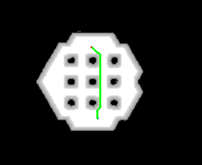
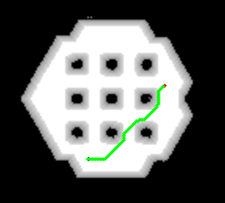
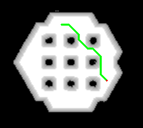
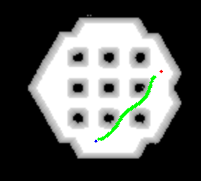
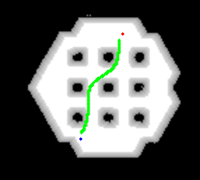
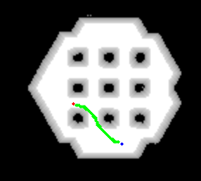

# A* Path Planning in C++

This repository implements the A* path planning algorithm in C++. The A* algorithm is widely used in robotics and game development for efficiently finding the shortest path from a start node to a goal node in a grid-based map while avoiding obstacles.

<p align="center">
  
</p>

## 🚀 Features

- Simple and efficient A* algorithm implementation
- Works on grid maps with user-defined obstacles
- Easy to configure start and goal positions
- Visual output (grid printed in terminal)
- Lightweight and dependency-free

## DEMO
<p align="center">
  
  
  
</p>
The above images show planning without post processing
<p align="center">
  
  
  
</p>
The above images show planning with post processing

## 📁 Directory Structure
├── astar.cpp # Core implementation of A* algorithm \
├── astar.hpp # Header file for A* class \
├── custom_map.cpp # Grid map creation and utility functions\
├── custom_map.h\
├── tests/test_planner.cpp # Main file to run the algorithm\
├── Makefile # Makefile for building the project\
└── README.md 

## 🧠 A* Algorithm Overview

A* finds the lowest-cost path from a start to a goal node by combining:
- **g(n)**: Cost from start node to current node `n`
- **h(n)**: Heuristic cost estimate from `n` to goal (using Manhattan distance here)
- **f(n) = g(n) + h(n)**: Total estimated cost

The algorithm uses a priority queue (min-heap) to explore nodes in order of lowest `f(n)`.

## ✅ Requirements

- C++11 or higher
- A C++ compiler (e.g. `g++`)
- Docker
- OpenCV 4.1.1

## ⚙️ Build Instructions

```bash
git clone https://github.com/ayushkumar8340/AStar-CPP.git
cd AStar-CPP
./build_docker.sh (builds the docker container with all the dependencies)
./run_docker.sh (runs the docker container)
mkdir build 
cd build 
cmake ..
make -j4
```

## Run the code
```bash
./test_planner
```